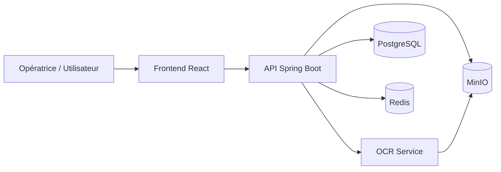
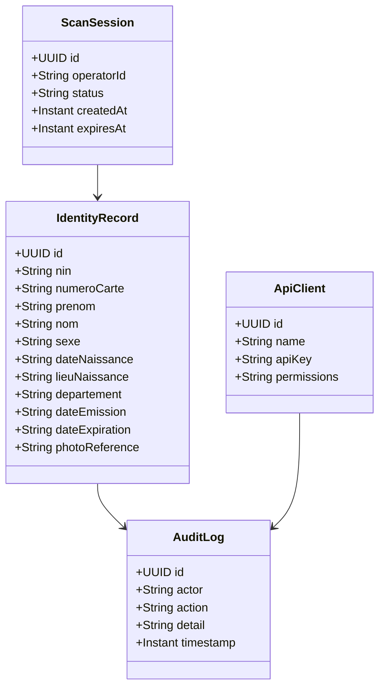
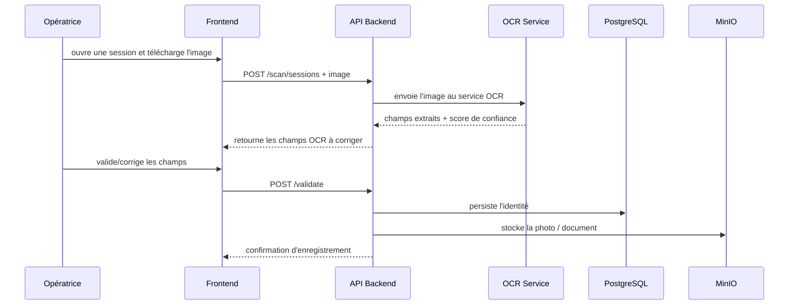
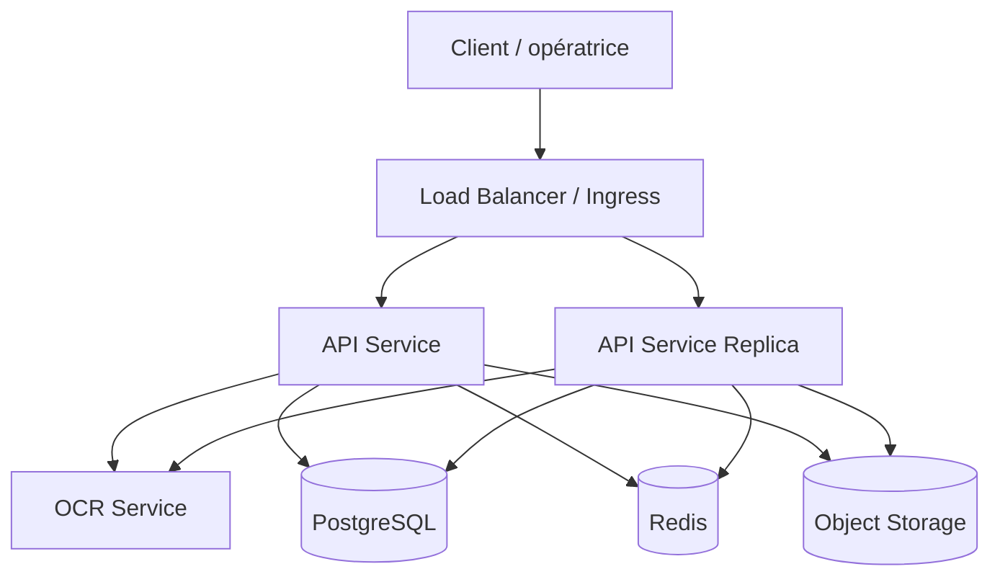

# Architecture technique retenue du microservice CIN Haïti

## Objectif

Ce document présente les décisions architecturales retenues pour construire un microservice de numérisation de la CIN haïtienne, robuste, portable.

---

## 1. Vision générale

L’architecture retenue repose sur un système modulaire composé de :

- un microservice principal Spring Boot pour l’orchestration métier,
- un service OCR dédié pour l’extraction de texte et de champs structurés,
- une interface React pour l’opératrice,
- une base PostgreSQL pour les données transactionnelles,
- Redis pour les sessions et la limitation de débit,
- MinIO pour le stockage des images et photos.

Cette combinaison a été choisie pour offrir :

- une excellente traçabilité du workflow,
- une bonne séparation des responsabilités,
- une portabilité simple avec Docker,
- une base solide pour une évolution vers une version production.

---

## 2. Architecture fonctionnelle

### Rôle de chaque couche

- Frontend : interface de numérisation, validation, correction et soumission
- API : orchestration, sécurité, workflow métier, export, audit
- OCR Service : extraction OCR et structuration des champs
- PostgreSQL : persistance des identités, sessions, logs d’audit et clients externes
- Redis : sessions temporaires, cache, throttling
- MinIO : images et photos de la CIN

---

## 3. Architecture technique détaillée

### 3.1 Service principal : API Spring Boot

Le service principal joue le rôle de cœur applicatif. Il est responsable de :

- l’ouverture et la gestion des sessions de scan,
- la réception des images,
- l’appel au service OCR,
- la restitution des champs extraits à l’interface,
- la validation humaine,
- l’enregistrement final des identités,
- l’export contrôlé vers des systèmes tiers,
- l’application des règles de sécurité et d’audit.

#### Technologies recommandées

- Java 21
- Spring Boot 3.x
- Spring Security
- Spring Data JPA
- Flyway
- OpenAPI / Swagger
- Lombok

### 3.2 Service OCR dédié

Le service OCR est séparé afin d’isoler la logique d’extraction et de faciliter l’évolution vers un moteur plus performant.

Cette séparation apporte :

- une meilleure qualité d’extraction,
- une maintenance simplifiée,
- une évolution indépendante du moteur OCR,
- une intégration plus simple avec des services externes.

#### Options recommandées

- Meilleure qualité : Azure AI Vision / Document Intelligence
- Solution locale : PaddleOCR ou Tesseract avec prétraitement avancé
- Solution hybride : OCR cloud comme primaire, Tesseract comme secours

### 3.3 Frontend React

Le frontend sert d’interface opératrice. Il permet :

- authentifier l’opératrice,
- ouvrir une session de scan,
- uploader une image,
- afficher les champs extraits,
- permettre la correction humaine,
- confirmer l’enregistrement final.

#### Technologies recommandées

- React 18
- Vite
- Tailwind CSS
- lucide-react

---

## 4. Architecture logique des données

### Entités principales

- ScanSession : session active ou clôturée
- IdentityRecord : identité enregistrée définitivement
- AuditLog : traçabilité des actions sensibles
- ApiClient : clients tiers autorisés à exporter des données

---

## 5. Flux fonctionnel principal

---

## 6. Architecture réseau et déploiement

### 6.1 Environnement de développement

L’environnement de développement est prévu autour de Docker Compose avec :

- backend API,
- frontend,
- PostgreSQL,
- Redis,
- MinIO,
- OCR service.

### 6.2 Environnement de production

Pour une évolution vers une mise en production, l’architecture peut être étendue vers :

- Kubernetes ou Azure Container Apps,
- PostgreSQL managé,
- Redis managé,
- stockage objet managé,
- secrets management,
- load balancer et TLS,
- monitoring et alerting.

---

## 7. Sécurité

### Composants de sécurité retenus

- Authentification JWT pour les opératrices
- Authentification par clé API pour les clients tiers
- Chiffrement des données sensibles
- TLS en transit
- Limitation de débit
- Audit trail complet
- Secrets externes via variables d’environnement ou secret manager

---

## 8. Fiabilité et robustesse

Pour renforcer la robustesse du système, nous retenons :

- des timeouts sur les appels OCR,
- des retries avec backoff,
- une logique de fallback si le service OCR est indisponible,
- la gestion d’erreurs utilisateur claire,
- un mécanisme d’idempotence pour la validation,
- une journalisation structurée.

---

## 9. Décision architecturale finale

La version la plus fiable et la plus portable retenue pour ce microservice est la suivante :

- un microservice backend Spring Boot comme cœur de l’application,
- un service OCR séparé pour l’extraction des champs,
- une base PostgreSQL pour les données métier,
- Redis pour les sessions et le cache,
- MinIO pour le stockage des images,
- un frontend React pour l’interface opératrice,
- une orchestration via Docker Compose au départ,
- puis une évolution vers Kubernetes ou Azure Container Apps si nécessaire.

Cette architecture est la plus adaptée pour :

- un prototype crédible,
- une démonstration technique solide,
- puis une évolution progressive vers une solution production.

---

## 10. Résumé exécutif

| Composant | Rôle principal | Technologie recommandée |
|---|---|---|
| Frontend | Interface opératrice | React + Vite |
| Backend | Orchestration métier | Java 21 + Spring Boot |
| OCR | Extraction de texte et champs | Azure Vision / PaddleOCR / Tesseract |
| Base de données | Données métier | PostgreSQL |
| Cache | Sessions / throttling | Redis |
| Stockage | Images et photos | MinIO |
| Déploiement | Portabilité | Docker Compose puis Kubernetes |
