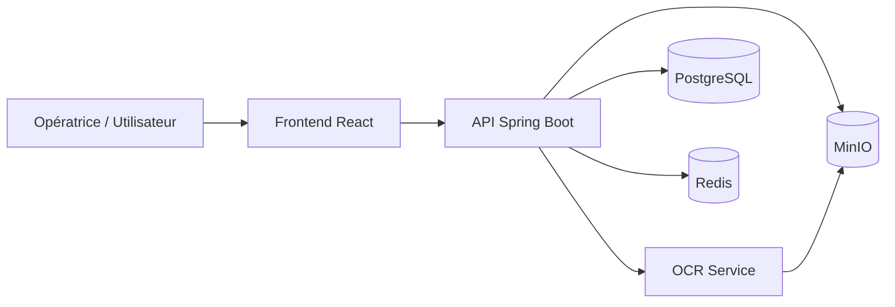
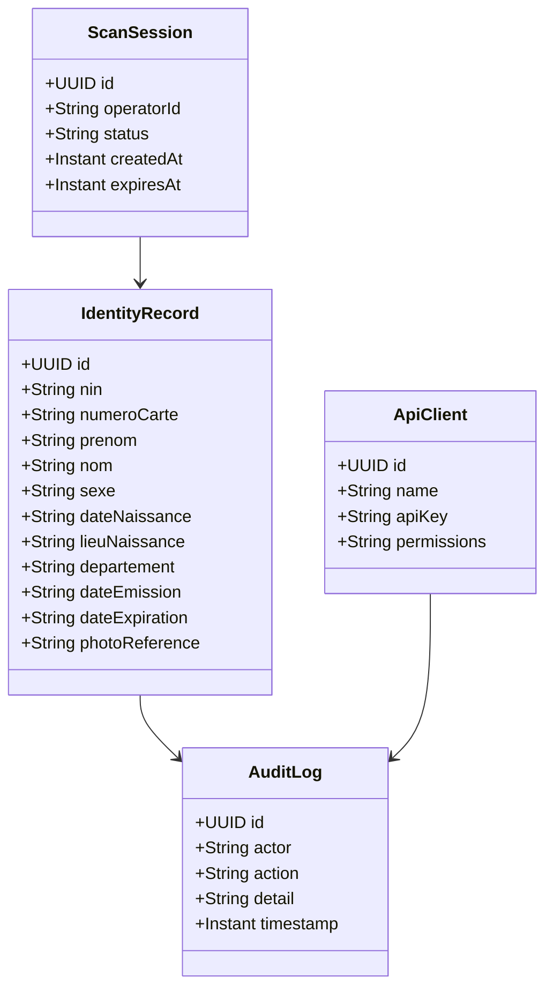
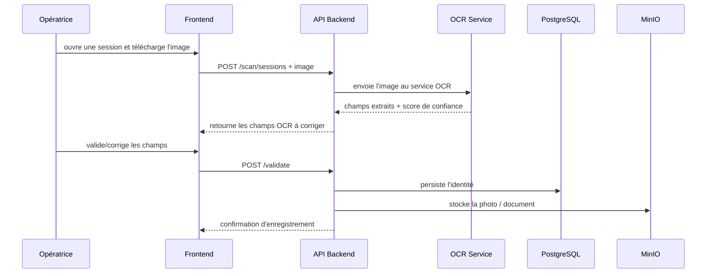
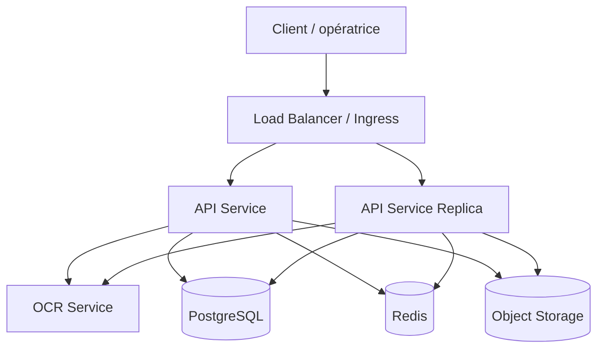

# Architecture technique retenue du microservice CIN Haïti

## 1. Objectif du document

Ce document présente les décisions architecturales retenues pour la conception d’un microservice de numérisation de la CIN haïtienne, avec un focus sur la robustesse et la portabilité.

---

## 2. Vue d’ensemble de l’architecture

L’architecture retenue repose sur un système modulaire composé de :

- un microservice principal Spring Boot pour l’orchestration métier,
- un service OCR dédié pour l’extraction de texte et de champs structurés,
- une interface React pour l’opératrice,
- une base PostgreSQL pour les données transactionnelles,
- Redis pour les sessions et la limitation de débit,
- MinIO pour le stockage des images et photos.

Cette combinaison a été choisie pour offrir :

- une bonne traçabilité du workflow,
- une séparation claire des responsabilités,
- une portabilité simple avec Docker,
- une base solide pour une évolution future vers une version production.

---

## 3. Architecture fonctionnelle

### Rôle de chaque composant

- Frontend React : interface de numérisation, validation et correction des données
- API Spring Boot : orchestration métier, sécurité, audit, export et gestion des sessions
- OCR Service : extraction OCR et structuration des champs détectés
- PostgreSQL : stockage des identités, sessions, logs d’audit et clients tiers
- Redis : sessions temporaires, cache et limitation de débit
- MinIO : stockage des photos et documents scannés

---

## 4. Architecture technique détaillée

### 4.1 Service principal : API Spring Boot

Le service principal joue le rôle de cœur applicatif. Il est responsable de :

- l’ouverture et la gestion des sessions de scan,
- la réception des images,
- l’appel au service OCR,
- la restitution des champs extraits à l’interface,
- la validation humaine,
- l’enregistrement final des identités,
- l’export contrôlé vers des systèmes tiers,
- l’application des règles de sécurité et d’audit.

#### Technologies retenues

- Java 21
- Spring Boot 3.x
- Spring Security
- Spring Data JPA
- Flyway
- OpenAPI / Swagger
- Lombok

### 4.2 Service OCR dédié

Le service OCR est séparé afin d’isoler la logique d’extraction et de faciliter l’évolution vers un moteur plus performant.

Cette séparation apporte plusieurs avantages :

- une meilleure qualité d’extraction,
- une maintenance simplifiée,
- une évolution indépendante du moteur OCR,
- une intégration plus simple avec des services externes.

#### Options retenues

- Meilleure qualité : Azure AI Vision / Document Intelligence
- Solution locale : PaddleOCR ou Tesseract avec prétraitement avancé
- Solution hybride : OCR cloud comme moteur principal, Tesseract comme secours

### 4.3 Frontend React

Le frontend sert d’interface opératrice. Il permet :

- d’authentifier l’opératrice,
- d’ouvrir une session de scan,
- d’uploader une image,
- d’afficher les champs extraits,
- de permettre la correction humaine,
- de confirmer l’enregistrement final.

#### Technologies retenues

- React 18
- Vite
- Tailwind CSS
- lucide-react

---

## 5. Modèle de données

### Entités principales

- ScanSession : session active ou clôturée
- IdentityRecord : identité enregistrée définitivement
- AuditLog : traçabilité des actions sensibles
- ApiClient : clients tiers autorisés à exporter des données

---

## 6. Flux fonctionnel principal

---

## 7. Déploiement et infrastructure

### 7.1 Environnement de développement

L’environnement de développement est prévu autour de Docker Compose avec :

- backend API,
- frontend,
- PostgreSQL,
- Redis,
- MinIO,
- OCR service.

### 7.2 Évolution vers la production

Pour une évolution vers une mise en production, l’architecture peut être étendue vers :

- Kubernetes ou Azure Container Apps,
- PostgreSQL managé,
- Redis managé,
- stockage objet managé,
- secrets management,
- load balancer et TLS,
- monitoring et alerting.

---

## 8. Sécurité et fiabilité

Les choix architecturaux retenus intègrent :

- une authentification JWT pour les opératrices,
- une authentification par clé API pour les clients tiers,
- le chiffrement des données sensibles,
- le TLS en transit,
- la limitation de débit,
- un audit trail complet,
- des timeouts et retries sur les appels OCR,
- une stratégie de fallback si le service OCR est indisponible,
- une journalisation structurée.

---

## 9. Décision architecturale finale

La solution retenue pour ce microservice est la suivante :

- un microservice backend Spring Boot comme cœur de l’application,
- un service OCR séparé pour l’extraction des champs,
- une base PostgreSQL pour les données métier,
- Redis pour les sessions et le cache,
- MinIO pour le stockage des images,
- un frontend React pour l’interface opératrice,
- une orchestration via Docker Compose au départ,
- puis une évolution vers Kubernetes ou Azure Container Apps si nécessaire.

Cette architecture est adaptée à un prototype crédible, à une démonstration technique solide, puis à une évolution progressive vers une solution production.

---

## 10. Résumé exécutif

| Composant | Rôle principal | Technologie retenue |
|---|---|---|
| Frontend | Interface opératrice | React + Vite |
| Backend | Orchestration métier | Java 21 + Spring Boot |
| OCR | Extraction de texte et champs | Azure Vision / PaddleOCR / Tesseract |
| Base de données | Données métier | PostgreSQL |
| Cache | Sessions / throttling | Redis |
| Stockage | Images et photos | MinIO |
| Déploiement | Portabilité | Docker Compose puis Kubernetes |
